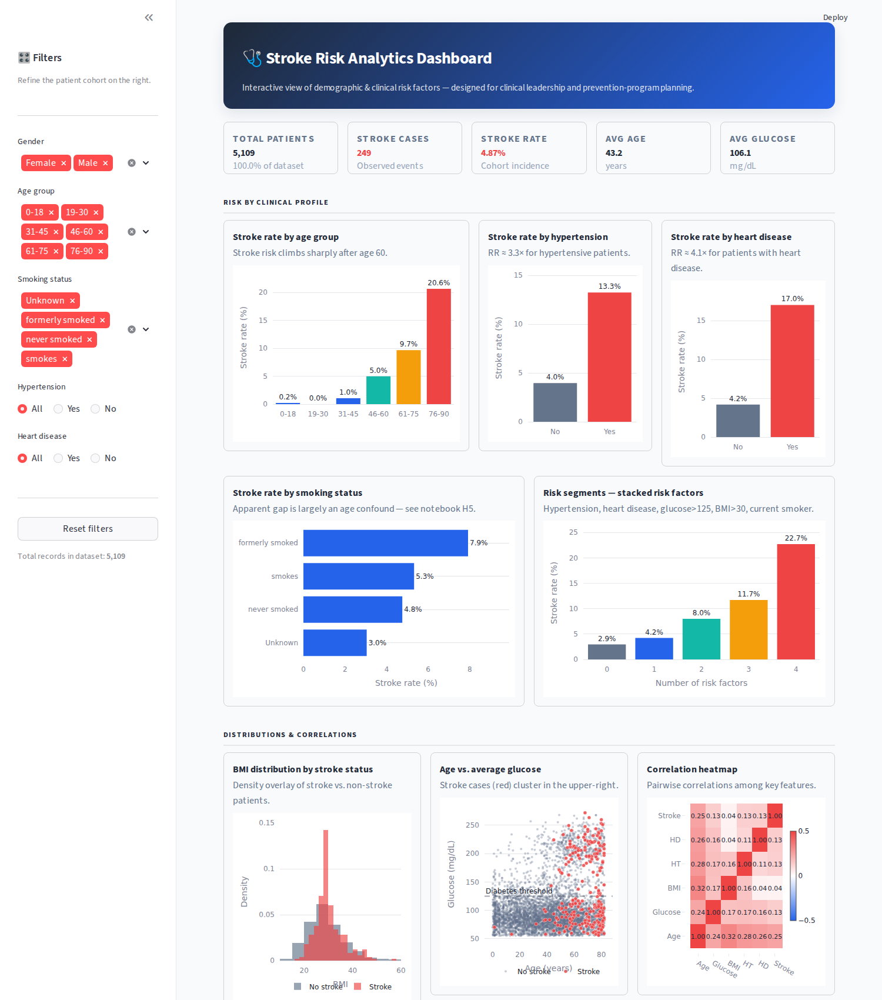

# Stroke Risk Analysis

> A hypothesis-driven analysis of demographic and clinical risk factors for stroke, with an interactive Streamlit dashboard for clinical leadership and prevention-program planning.




---

## Table of Contents

- [Project at a glance](#project-at-a-glance)
- [Problem statement](#problem-statement)
- [Hypotheses](#hypotheses)
- [Headline results](#headline-results)
- [Recommendations](#recommendations)
- [Project structure](#project-structure)
- [Setup (Windows)](#setup-windows)
- [Setup (macOS / Linux)](#setup-macos--linux)
- [How to use](#how-to-use)
- [GitHub workflow](#github-workflow)
- [Limitations](#limitations)
- [License & dataset](#license--dataset)

---

## Project at a glance

Stroke is the **second-leading cause of death globally** (~11% of all deaths, WHO). Most strokes are preventable, and risk is concentrated in a handful of well-known clinical and lifestyle factors. A regional healthcare network with limited screening capacity needs an analytics-driven answer to a tactical question: **which patient segments should be invited to in-depth assessment first?**

This project answers that question end-to-end:

| Layer | Deliverable |
|---|---|
| **Analysis** | Hypothesis-driven Jupyter notebook with formal statistical tests |
| **Dashboard** | Interactive Streamlit app with KPI cards, filters, and 8 Plotly charts |
| **Documentation** | This README, inline notebook narrative, and stakeholder-facing recommendations |

**Stack:** Python 3 · pandas · scipy · seaborn · plotly · streamlit

---

## Problem statement

A regional healthcare network wants to launch a *stroke-prevention screening program* but has limited capacity. Two practical questions need answering:

1. **Which demographic and clinical factors are most strongly associated with stroke incidence in our patient population?**
2. **Which patient segments should be prioritised for screening to maximise the number of preventable strokes identified per invitation sent?**

The analysis frames these as testable hypotheses, validates each with formal tests, and translates the findings into a tiered screening rule.

---

## Hypotheses

Five testable hypotheses, each grounded in clinical literature:

| # | Hypothesis | Test |
|---|---|---|
| **H1** | Age is the strongest demographic driver of stroke. Stroke patients are substantially older than non-stroke patients. | Mann-Whitney U |
| **H2** | Patients with **hypertension** have a stroke rate several times higher than those without. | Chi-square + Relative Risk |
| **H3** | Patients with **heart disease** have a stroke rate several times higher than those without. | Chi-square + Relative Risk |
| **H4** | Stroke patients have **higher average glucose levels** than non-stroke patients — a marker of underlying metabolic disease. | Mann-Whitney U |
| **H5** | The headline association between **smoking status** and stroke largely reflects an **age confound** — once we condition on older age groups, smoking class no longer differentiates risk. | Stratified chi-square |

H5 is the most analytically interesting: it forces the analysis to distinguish *correlation* from *driver*, which is exactly the discipline a stakeholder needs.

---

## Headline results

| Hypothesis | Test statistic | p-value | Effect size | Verdict |
|---|---|---|---|---|
| H1 — Age | Mann-Whitney U = 1,010,126 | 1.9 × 10⁻⁷¹ | Mean gap: +25.8 years | **Confirmed** |
| H2 — Hypertension | χ² = 81.6 | 1.7 × 10⁻¹⁹ | RR = 3.34× | **Confirmed** |
| H3 — Heart disease | χ² = 90.3 | 2.1 × 10⁻²¹ | RR = 4.08× | **Confirmed** |
| H4 — Glucose | Mann-Whitney U = 739,150 | 1.8 × 10⁻⁹ | Median gap: +13.7 mg/dL | **Confirmed** |
| H5 — Smoking confound | All ages: p ≈ 10⁻⁶ → Age 60+: p ≈ 0.91 | — | Effect collapses on stratification | **Confirmed** |

### The compounding signal

Risk factors **stack non-linearly**. Defining `risk_factors` as the count of {hypertension, heart disease, glucose > 125 mg/dL, BMI > 30, current smoker}:

| Risk factors | Patients | Stroke rate |
|---|---|---|
| 0 | 1,940 | 2.9% |
| 1 | 2,118 | 4.2% |
| 2 | 805 | 8.0% |
| 3 | 215 | 11.7% |
| 4+ | 31 | 22.7% |

Patients with 3 or more risk factors have a stroke rate **roughly 5× the population baseline (4.87%)**.

---

## Recommendations

**For the prevention-program manager:**

1. **Tier the screening invitation by stacked risk factors.**
   - **Tier 1 (highest priority):** patients with ≥ 2 of {hypertension, heart disease, glucose > 125 mg/dL}.
   - **Tier 2:** patients aged 60+ with any one of those conditions.
   - **Tier 3:** patients aged 60+ with no flagged conditions (lower yield, sizeable population).
2. **Use age 60 as the default lower bound** for proactive outreach. Below that age the stroke rate is too low to justify routine screening cost.
3. **Treat hypertension and heart disease as equivalent triggers** — they carry similar relative risks and should not require both to be present.
4. **Do not deprioritise non-smokers** purely on smoking status. The unconditional smoking-status signal does not survive age stratification in this data.
5. **Monitor the program's catch rate** within each tier; if Tier 3 yield falls below ~5%, reallocate capacity upward.

**For analytics follow-up:**

- Build a logistic-regression risk score with the four primary factors (age, hypertension, heart disease, glucose category) and validate on a held-out split.
- Re-collect smoking status for the "Unknown" subgroup before any future stroke analysis — that single column has the largest data-quality lever in the dataset.
- Consider longitudinal records to enable time-to-event modelling.

---

## Project structure

```
stroke-risk-analysis/
│
├── data/
│   └── raw/
│       └── healthcare-dataset-stroke-data.csv   # source dataset
│
├── notebooks/
│   └── stroke_risk_analysis.ipynb               # main analysis (executed)
│
├── dashboard/
│   └── app.py                                   # Streamlit dashboard
│
├── plots/
│   └── dashboard_preview.png                    # screenshot for README
│
├── src/                                         # reserved for future modules
│
├── README.md
├── requirements.txt
└── .gitignore
```

---

## Setup (Windows)

Tested on Windows 10/11 with Python 3.10+ and PowerShell.

### 1. Get Python

If Python isn't installed yet, grab it from [python.org/downloads](https://www.python.org/downloads/) — **make sure to tick "Add Python to PATH"** during installation.

Verify:

```powershell
python --version
```

### 2. Clone the repository

```powershell
git clone https://github.com/<your-username>/stroke-risk-analysis.git
cd stroke-risk-analysis
```

### 3. Create and activate a virtual environment

```powershell
python -m venv venv
.\venv\Scripts\activate
```

You should now see `(venv)` at the start of your prompt.

> **PowerShell execution-policy error?** Run this once as administrator:
> `Set-ExecutionPolicy -Scope CurrentUser -ExecutionPolicy RemoteSigned`

### 4. Install dependencies

```powershell
python -m pip install --upgrade pip
pip install -r requirements.txt
```

### 5. Download the dataset

The repository ships with the dataset already in `data/raw/` (it's small and freely licensed). If for any reason it's missing, download `healthcare-dataset-stroke-data.csv` from [Kaggle: Stroke Prediction Dataset](https://www.kaggle.com/datasets/fedesoriano/stroke-prediction-dataset) and place it there.

### 6. Run the notebook

```powershell
jupyter notebook notebooks/stroke_risk_analysis.ipynb
```

### 7. Run the dashboard

```powershell
streamlit run dashboard/app.py
```

Streamlit will open the dashboard in your browser at [http://localhost:8501](http://localhost:8501).

### 8. (Optional) Regenerate `requirements.txt`

If you add new dependencies during development:

```powershell
pip freeze > requirements.txt
```

### 9. Deactivate the environment when done

```powershell
deactivate
```

---

## Setup (macOS / Linux)

```bash
git clone https://github.com/<your-username>/stroke-risk-analysis.git
cd stroke-risk-analysis

python3 -m venv venv
source venv/bin/activate

pip install --upgrade pip
pip install -r requirements.txt

# Run the notebook
jupyter notebook notebooks/stroke_risk_analysis.ipynb

# Run the dashboard
streamlit run dashboard/app.py
```

---

## How to use

### Notebook

`notebooks/stroke_risk_analysis.ipynb` is the analytical core. Read it top-to-bottom — the structure mirrors the way an analyst would present findings to a clinical stakeholder:

1. Introduction → why stroke matters
2. Problem statement → translated into an analytical question
3. Hypotheses (H1–H5) → stated up-front, before the data is touched
4. Data understanding → schema and key statistics
5. Data cleaning → with justification for every choice
6. Focused EDA → only views that serve the hypotheses
7. Hypothesis testing → formal tests, one per hypothesis
8. Key insights, conclusion, recommendations

### Dashboard

`dashboard/app.py` is for stakeholders who want to explore the data themselves. The sidebar lets you filter by gender, age group, smoking status, hypertension, and heart disease. Every chart, KPI, and the insight box recalculate from the filtered cohort in real time.

**Try this:** filter to *Hypertension = Yes* and *Age group = 76-90* — the stroke rate KPI should jump to roughly 25%, demonstrating the compounding insight directly.

---

## GitHub workflow

If you've cloned the project and want to push your own version to GitHub:

```bash
# Initialise (only if you haven't cloned)
git init
git add README.md requirements.txt .gitignore notebooks dashboard data plots

# Stage everything that isn't ignored
git add .

# First commit
git commit -m "Initial commit: stroke risk analysis end-to-end project"

# Connect to your GitHub repo and push
git remote add origin https://github.com/<your-username>/stroke-risk-analysis.git
git branch -M main
git push -u origin main
```

**Recommended commit cadence during development:**

```bash
git add notebooks/stroke_risk_analysis.ipynb
git commit -m "Add hypothesis testing for H4 (glucose)"

git add dashboard/app.py
git commit -m "Polish smoking chart x-axis padding"
```

**What to commit / what to ignore:** the `.gitignore` already handles this. The headline rules:
- ✅ Commit code, the notebook, the README, requirements.txt, the raw CSV (small, public dataset), and the dashboard preview
- ❌ Don't commit `.venv/`, `__pycache__/`, `.ipynb_checkpoints/`, OS junk like `.DS_Store`, or anything containing real patient data

---

## Limitations

This is an honest portfolio piece, so the limitations are stated up front:

1. **Cross-sectional, not longitudinal.** The dataset records whether a patient has ever had a stroke, not when. Causal claims would require time-to-event data.
2. **Imbalanced target.** Only 4.87% of records are positive — every interpretation is therefore framed around *relative risk* and *rates*, never raw counts.
3. **"Unknown" smoking status** accounts for ~30% of records and is over-represented in younger patients. This biases the smoking analysis (H5) and limits how strongly any smoking conclusion should be generalised.
4. **Single source.** The dataset is from one collection; replication across populations would strengthen any clinical recommendation.
5. **Associative, not causal.** All findings here describe what the data shows — not what *causes* stroke. The recommendations are framed as *prioritisation rules* for screening, not *mechanistic claims*.

---

## License & dataset

- **Code:** MIT — feel free to use, modify, and learn from.
- **Dataset:** [Stroke Prediction Dataset](https://www.kaggle.com/datasets/fedesoriano/stroke-prediction-dataset) on Kaggle, by user *fedesoriano*. Released under the [Open Data Commons Open Database License (ODbL)](https://opendatacommons.org/licenses/odbl/1-0/).

---

## Acknowledgments

Built as an end-to-end data-analytics portfolio project following a hypothesis-driven workflow. Storytelling structure inspired by *Storytelling with Data* (Cole Nussbaumer Knaflic).
